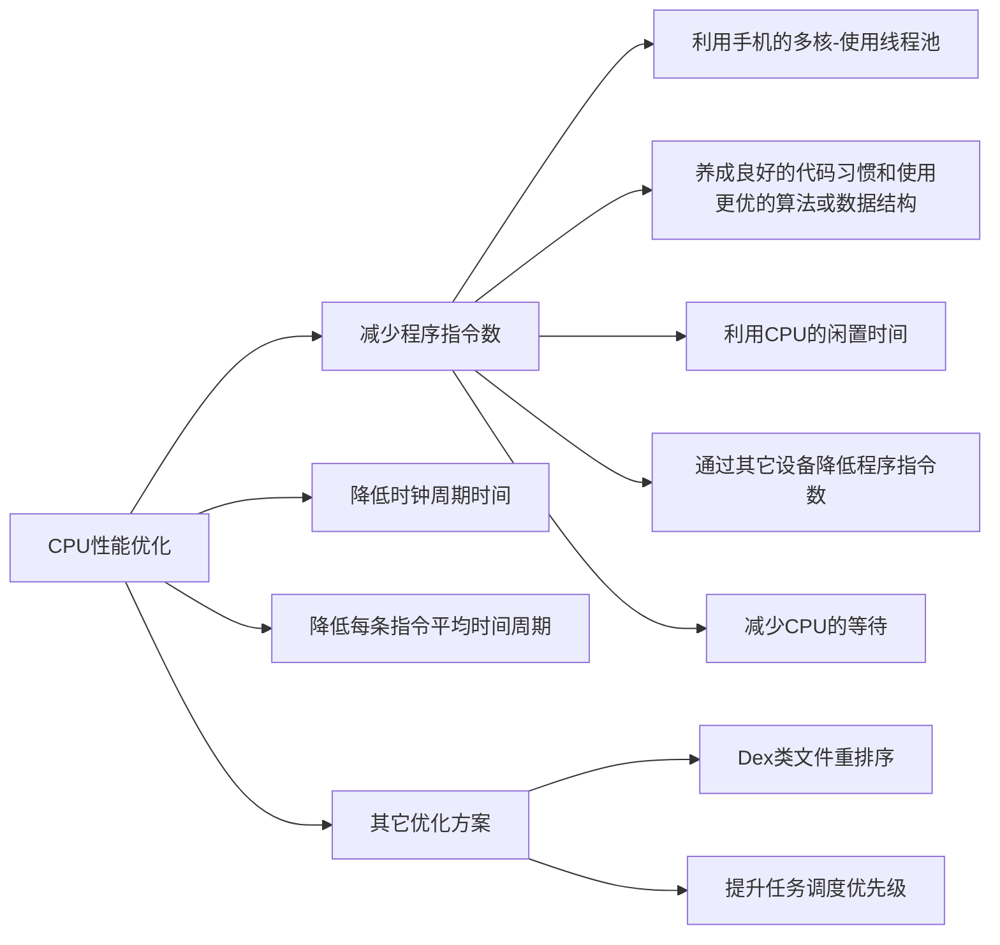

https://juejin.cn/post/7249623814149013562

从硬件到操作系统再到软件层，自底向上系统的介绍了如何去做性能优化，其实不仅仅是CPU优化可以这样去思考解决，还有内存优化、
包体积优化、网络优化等等方面都可以采用这套逻辑。回归性能优化的本质是**合理且充分使用硬件资源，让程序的表现更好** ，
**“充分”就是将硬件的资源充分发挥出来。**  但要注意，充分不一定是合理的。比如我们一下开启了几百个线程，CPU 被充分发挥了，
却这并不合理，因为此时主线程无法获得足够的 CPU 资源，那**合理就是所发挥出来的硬件资源能给程序表现带来正向的作用**。
然而性能优化也并不容易，想要做好性能优化，需要庞大的知识储备。

> 硬件层面：我们需要对CPU的工作方式有了解，CPU的单核和多核等结构、寄存器、高速缓存、主存的设计等等。

> 系统层面：对操作系统有一定的了解也是必要的，这里包括但不仅限于进程的管理和调度、内存管理、虚拟内存等等，Andorid系统还有
> 虚拟机、核心服务（ams、wms等）以及核心流程（启动、Activity、包安装）等等。

> 软件层面：这要求我们熟悉自己开发的App，了解App使用缓存的情况，每个线程是干嘛的，使用都合理吗？是否因为如bitmap等不合理
> 的使用或者不良的编程习惯而占用大量内存等等情况。

> 其他方面：除上面三个基本的之外，我们可能还需要掌握更多知识，例如：汇编、编译器、逆向、各种编程语言，比如用 C++ 写代码就
> 比用 Java 写代码运行更快，我们可以通过将一些业务替换成 C++ 来提高性能，用 C 或者 C++ 编写模块做JNI调用等。
