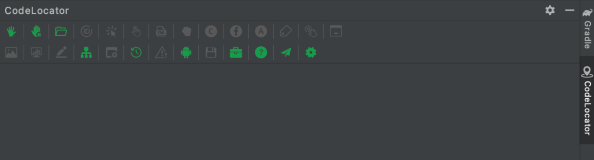
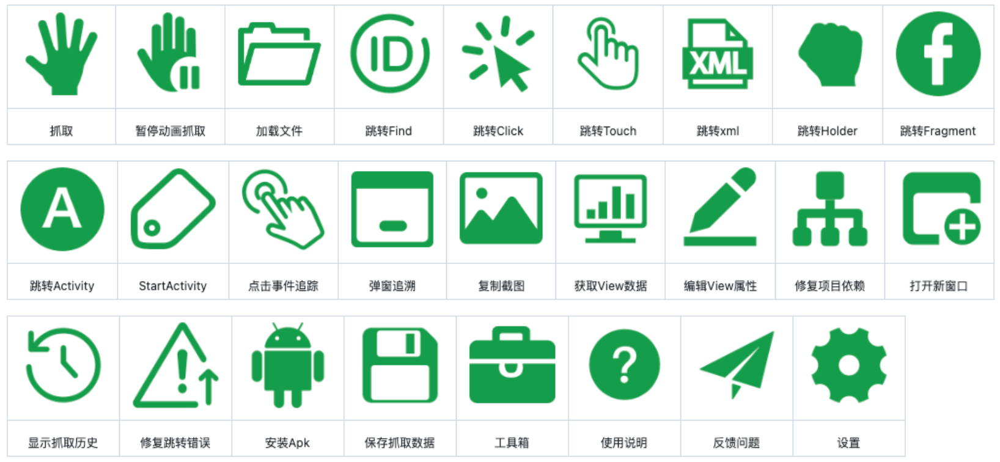
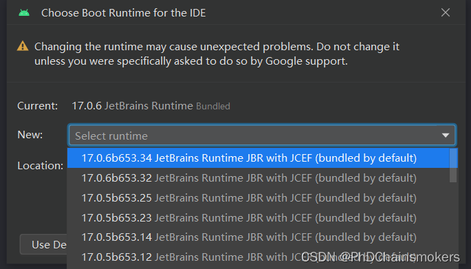
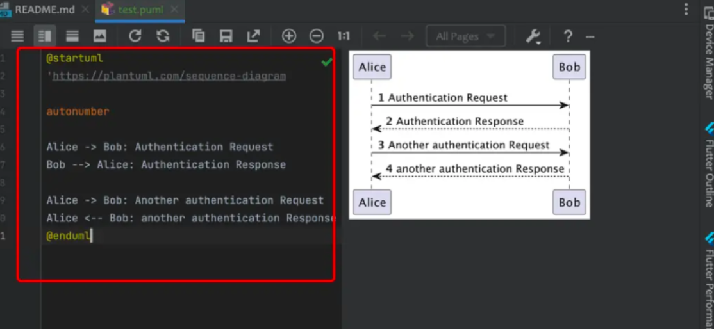
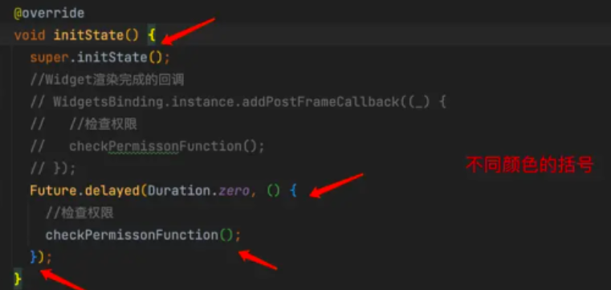
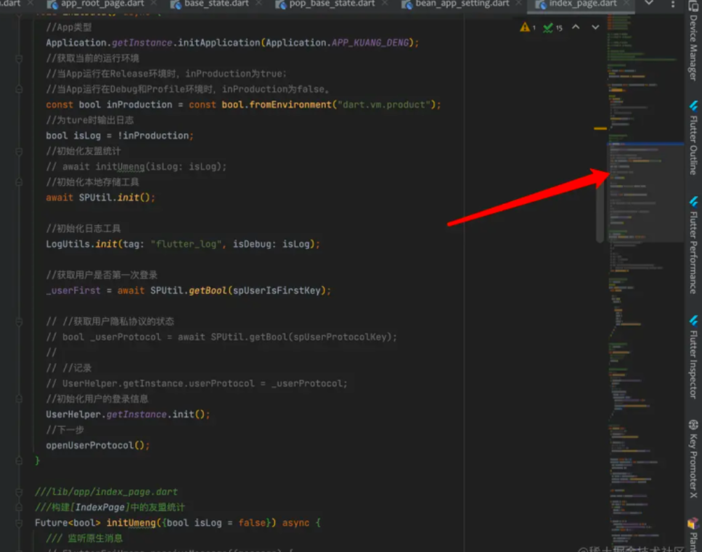

## **Android Studio 插件推荐**

1. CodeLocator 字节开源的Android开发工具集
2. Markdown JetBrains开发的MarkDown文档编辑预览工具
3. Translation 一款翻译插件
4. Statistic 代码统计工具
5. Key Promoter X 快捷键提示
6. Restful Fast Request IDEA版的Postman
7. PlantUML Integration 绘制UML
8. Sequence Diagram 根据代码生时时序图
9. String Manipulation 用来处理字符串
10. Rainbow Brackets 彩虹括号
11. Android Wifi 连接手机进行调试
12. CodeGlance Pro 代码缩略浏览
13. SonarLint 代码 review 插件

## **CodeLocator**
CodeLocator 是字节跳动开源的一个包含 Android SDK 与 Android Studio 插件的 Android 工具集。(mac、windows都可以用)
> https://github.com/bytedance/CodeLocator

#### Android Studio中安装 CodeLocator 插件

下载最新插件 zip 文件到本地。下载地址如下
> https://github.com/bytedance/CodeLocator/releases

选择 `Android Studio > Preferences > Plugins > Install Plugin from Disk` ，选择下载的Zip文件安装即可。

#### 工程中集成CodeLocator

```
// 集成基础能力, 只需要添加一行依赖即可
dependencies {
    // 依赖androidx, 已升级AndroidX的项目集成下面的依赖
    implementation "com.bytedance.tools.codelocator:codelocator-core:2.0.3"
    // 未升级AndroidX的项目集成下面的依赖 support版本不再维护 请升级androidx
    implementation "com.bytedance.tools.codelocator:codelocator-core-support:2.0.0"
}
```

目前官网描述的代码跳转的能力，需要集成 Lancet，但是Lancet的引入有关于Gradle 版本和AGP 版本的要求

> 集成Lancet 插件和依赖的项目，关于Gradle 版本和AGP 版本不能适配超过7.2，不建议高版本去适配，已经帮大家踩了很多坑了。
> 还有，CodeLocator对compose支持不是友好

当工程的依赖和Android Studio的插件都到位之后，便可以启动开发app，然后使用抓取功能和调试开发。

能和调试开发。

#### **界面介绍**

CodeLocator 插件是一个侧边栏插件, 安装后会在Android Studio的右侧, 点击Tab即可展开插件, 初始状态如下


#### **功能介绍**
CodeLocator目前支持二十六种按钮操作, 当按钮呈现绿色高亮时表示可点击, 鼠标悬停一段时候后会出现具体的功能描述。


## **Markdown**
Android Studio中的MarkDown插件默认是无法预览md文件的，但是在IDEA里面是可以的。
解决方案：以Windows 10操作系统为例，点击Android Studio工具栏上的Help菜单，然后点击Find Action子菜单。
在弹出框中输入或粘贴 Choose Boot Java Runtime for the IDE，点击选中之后，会出现一个弹出框，
在弹出框的“New”选项的下拉列表里，选择最上面一项，然后点击OK，最后重启Android Studio即可。


## **Translation**
直接在Android Studio的Settings的Plugins中安装此插件。
需要翻译文字时，直接选中需要翻译的内容，点击右键即可找到翻译按钮。

## **Statistic**
代码统计工具，可以用来统计当前项目中代码的行数和大小。
安装后，通过顶部菜单中的View->Tool Windows->Statistic按钮开启该功能。

## **Key Promoter X**
Key Promoter X 是一款帮助你快速学习快捷键的插件，当你在AndroidStudio中用鼠标点击某些功能时，它会自动提示你使用该功能的快捷键。

## **Restful Fast Request**
是IDEA版本的Postman，它是一个功能强大的Restful API工具包插件，在AndroidStudio中也可以根据已有的方法快速生成接口调试用例。

## **PlantUML Integration**
PlantUML是一款开源的UML图绘制工具，支持通过文本来生成图形。

时序图（Sequence Diagram），是一种UML交互图。它通过描述对象之间发送消息的时间顺序显示多个对象之间的动态协作。


更多详细的用法，可以查看官网
> https://plantuml.com/zh/

## **Sequence Diagram**
根据代码生成时序图的插件，还支持在时序图上直接导航到对应代码以及导出为图片或PlantUML文件。

## **String Manipulation**
处理字符串的插件，支持各种格式代码命名方式的切换、支持各种语言的转义和反转义、支持字符加密、支持多个字符的排序、对齐、过滤等等。

在使用的时，只需要选中字符串，然后点击右键，菜单中找到“String Manipulation”即可。

## **Rainbow Brackets**
彩虹括号。代码复杂嵌套多层的情况下，往往括号会很多，可读性变差。

如果成对的括号颜色相同，不成对的括号颜色不同，那就可以提升代码阅读性，如下图


## **Android Wifi**
连接手机进行调试。

使用Android Studio  Dolphin | 2021.3.1 Patch 1  及以上版本选择点击  Pair Devices Using Wi-Fi  弹出扫码框。
提示使用android11+ 的设备扫码连接。这时需要手机和电脑连同一个无线网。然后在手机开发者选项里面找到  无线调试，一般在USB
调试开关下面。点击 无线调试 开启 无线调试 功能。点击无线调试页面的  使用二维码配对设备 扫描AS的二维码链接调试。等待一会链
接好后就可以看到设备信息了。

## **CodeGlance Pro**
代码视图页面生成浏览目录


## **SonarLint**
Sonar是一个用于代码质量管理的开源平台，用于管理源代码的质量 通过插件形式，可以支持包括java,C#,C/C++,PL/SQL,Cobol,
JavaScrip,Groovy等等二十几种编程语言的代码质量管理与检测
