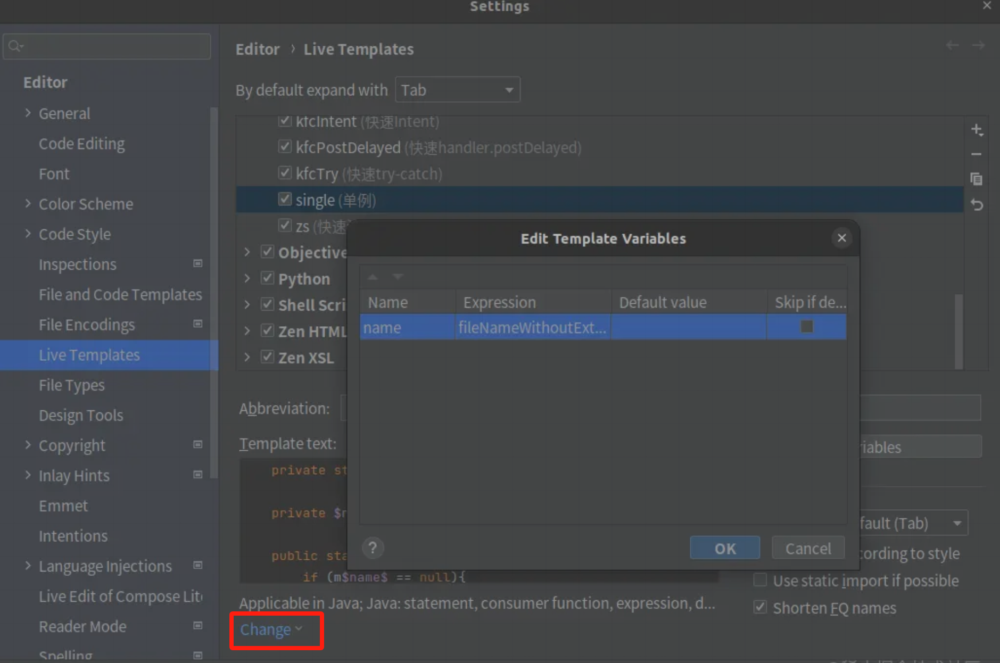

### 前言

我们平常开发时，可以使用IDE提供的一些功能来实现提高开发效率，避免写重复代码的效果。而Android Studio提供的Live Templates
绝对算得上一个得力助手。

### 何为模板

当年MVVM还刚开始传播，正是MVP大火之时，然后当时的人写MVP都有个习惯，按着一套模板来写，
写个xxxActivity类，写个xxxPresenter类，写个xxxModel类，然后这些类有很多相同的代码。这时候就有人发明出了一些插件，
通过这些插件你就能一键生成这些类，然后就做些许改动就行，有点流水线的意思。

Live Templates也是这个道理，我帮你生成一些常用的代码结构，然后只需要细节的改动就行，省去很多写重复代码的时间，
有的人可能会说封装啊，其实如果你项目大的话，你就会发现，即便你封装了很多东西，哪怕你甚至去封装和业务相关的代码，
都还是照样会写很多重复代码。Live Templates相对于上面的插件，会更轻量级，而且这是官方提供的工具。

**Live Templates在我使用的时候主要是能为我提供3个好处：**

（1）快速生成代码，不用再写点点点

（2）防止复制时可能会出现的一些细节上没改过来

（3）会有我自己的提示，忘记一些API的使用方式的话不用再花时间去查

### 使用Live Templates

在AS中点开 **File -> Settings -> Editor -> Live Templates**


创建模板后在页面中的Template text中输入模板内容，在change中选择模板范围，有变量的话再Edit variables中设置变量，这些后面都会讲。

基本就是定义几个组，然后组内有几个模板，我个人是分为3个组，一个是常用的功能代码，一个是和业务相关的，一个是其它操作。

**注意了，这里有个细小的知识点，看到我自己写的模板，都是kfc开头的，你以为是随便搞得？当然不是，这是为了避免和系统的关键
字冲突并且让我更好的查我忘记的方法，就是上面的好处（3）**

当忘记某个方法时，只需要输入kfc，弹出的选项框中，每项都是kfc开头，且每项都可以有中文注释。
比如想使用Glide，但忘记怎么使用了，一般的做法是，要么去其它的地方copy代码过来，
若没写过就百度搜索。但是用了模板后，这里只需输入kfc，找到后一个回车，完事儿。

### 举例模板

在Template text中写个单例模板

```
private static volatile $name$ m$name$ = null;

private $name$(){}

public static $name$ getInstance(){
    if (m$name$ == null){
        synchronized ($name$.class){
            if (m$name$ == null){
                m$name$ = new $name$();
            }
        }
    }
    return m$name$;
} 
```

然后在Change里面选java，因为这段代码是java的嘛，**不要全选，不然比如你会在kotlin中也能输入single打出这段代码，这就尴尬了**

然后因为我这里有变量name，所以要在Edit variables中给变量定规则。这里Expression里面选的就是类名简称，
所以这里的name在补全出来之后就会替换成类名。


这是其中一种设置模板的方法，带变量的方式。但是因为用变量的话得设置Edit variables，但它有时候并不能去适配所有的场景，
所以这边还有一种不带参数的设置模板的方式。

**其主要核心有2点：**
（1）随便用什么代替变量，主要是补全后会让那个地方爆红，然后去修改变量就行（这比复制粘贴更安全）
（2）宁可多写，然后删除用不上的代码，因为我们删除的速度比写代码的速度快。

比对一个Glide的使用设置一个模板，可以这样写kfcGlide

```
Glide.with(context)
        .load(xxxxx)
        .placeholder(xxxxx)
        .error(xxxxx)
        .into(imageView);
```

这里xxxxx只是占位符，补全后编译器会爆红给你提示，再替换参数就行，然后如果你不想使用placeholder或error的话，直接删除就行，
好过你写模板的时候不写它们，但要用的时会加上去，**删总比敲的快。**

### 其它

#####  Expression

首先关于Expression的各个含义，网上可以查一下。

##### 导出模板

关于如何导出模板，比如我们写了很多模板，但是我们因为某些原因要换另外一台的AS，这时候，我们总不可能把这么多模板重新写吧，
哪怕一个个复制粘贴过来配置也是花费时间啊，**其实模板能导入导出**

**File -> Manager IDE Settings -> Exprot Settings -> 选所有的Live Templates选项**

导出后能看到一个xml，这个就是我们导出的模板文件。导入也一样，就是将此xml文件导入到AS中即可。

##### 系统默认提供的Live Templates

可以看到上面说明的是如何自定义我们的模板，但其实AS默认也是会提供一些模板的，看这张图就知道

AS有给你提供Java的，kotlin的，甚至C++和Python的都有。这个就太多了，如果想学的话可以去网上查。它给你提供的模板也是
很有用的，举个例子，比如说写for循环

如果你不知道模板的话，你可能就会直接写for(){}，然后按部就班的写其它代码，但是如果你使用AS给你提供的模板，你只需
要输入5.fori就可以了。

