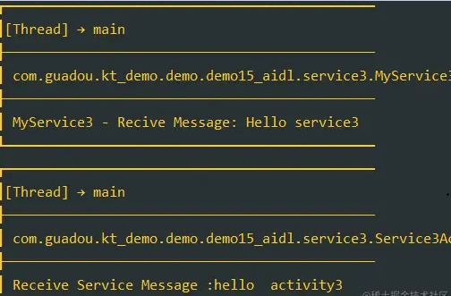

说起Activity与Service通信了，既然有通信了，那肯定得bindService了，那到底如何通信呢？

使用广播？使用消息总线？SharedFlow .........？

这些方式消息传递比较单向，Service可以通过消息总线之类的传递信息给Activity，Service也可以通过 `intent.putExtra` 
和 `onStartCommand` 回调接收Activity的数据... 只是不够常规算是偏门的方法。

传统Activity与Service有几种通信方式：

#### 1.Binder的方式

通过默认的Binder通信，Binder相当于一个传话筒，确定是不能跨进程通信。

**Activity：**

```kotlin
class Service1Activity : BaseVDBActivity<EmptyViewModel, ActivityDemo15Service1Binding>() {

    var mBinder: MyBinder1? = null

    private val mConnection: ServiceConnection = object : ServiceConnection {
        override fun onServiceConnected(componentName: ComponentName, iBinder: IBinder) {
            mBinder = iBinder as MyBinder1

            //设置监听回调
            mBinder?.setOnCallbackListener { msg ->
                YYLogUtils.w("Receive Service Message :$msg")
            }
        }

        override fun onServiceDisconnected(componentName: ComponentName) {}
    }


    companion object {
        fun startInstance() {
            commContext().let {
                it.startActivity(Intent(it, Service1Activity::class.java).apply {
                    addFlags(Intent.FLAG_ACTIVITY_NEW_TASK)
                })
            }
        }
    }

    override fun getDataBindingConfig(): DataBindingConfig {
        return DataBindingConfig(R.layout.activity_demo15_service1)
    }

    override fun startObserve() {
    }

    override fun init() {
        //自动启动Service并绑定
        val intent = Intent(this, MyService1::class.java)
        bindService(intent, mConnection, BIND_AUTO_CREATE)

        //发送数据触发事件
        mBinding.btnSend.click {
            //点击调用Service方法，并在上面收到回调
            mBinder?.doServiceMethod("Msg From Activity")

        }
    }
}
```

**Service:**

```kotlin
class MyService1 : Service() {

    private val mBinder: MyBinder1 = MyBinder1(this)

    override fun onBind(intent: Intent?): IBinder {
        return mBinder
    }

    fun doSomeThing(message: String): String {

        //做什么事情呢 ...
        YYLogUtils.w("MyService1 - Recive Message: $message")

        return "Hello Activity"
    }

}
```

**Binder:**

```kotlin
class MyBinder1(private val service: MyService1) : Binder() {
    var callback: ((String) -> Unit)? = null

    fun setOnCallbackListener(action: ((String) -> Unit)?) {
        callback = action
    }

    //调用Service的方法
    fun doServiceMethod(message: String) {
        val msg = service.doSomeThing(message)

        callback?.invoke(msg)
    }

}
```

效果如下：


没什么好说的，一旦把Service设置为多进程启动，就会报错，IBinder类型转换异常了。 如果想要实现多进程之间的相互通信，
还得靠老牌AIDL实现。

#### 2.AIDL的方式

重点来了，我们都知道AIDL可以实现跨进程通信，内部基于Binder实现。如何使用呢？

我们定义2个AIDL类：


```java
interface IMyService2Interface {

   void doServiceMethod(String msg);
   void destoryService();

   void registerListener(IMyCallbackInterface listener);

   void unregisterListener(IMyCallbackInterface listener);

}

interface IMyCallbackInterface {

 void onCallback(String msg);

}
```

和直接用Binder的方式差不多，只不过这里的Binder继承的是我们AIDL类的Stub

**Binder:**

```kotlin
class MyBinder2(private val service: MyService2) : IMyService2Interface.Stub() {

    private val mRemoteCallbackList: RemoteCallbackList<IMyCallbackInterface> = RemoteCallbackList()

    //调用Service的方法
    override fun doServiceMethod(message: String?) {
        val msg = service.doSomeThing(message)

        val count = mRemoteCallbackList.beginBroadcast()
        for (i in 0 until count) {
            mRemoteCallbackList.getBroadcastItem(i).onCallback(msg)
        }
        mRemoteCallbackList.finishBroadcast()
    }

    override fun destoryService() {
        service.shotdown()
    }

    override fun registerListener(listener: IMyCallbackInterface?) {
        mRemoteCallbackList.register(listener)
    }

    override fun unregisterListener(listener: IMyCallbackInterface?) {
        mRemoteCallbackList.unregister(listener)
    }

}
```

**Service:**

```kotlin
class MyService2 : Service() {

    private val mBinder: MyBinder2 = MyBinder2(this)

    override fun onBind(intent: Intent?): IBinder {
        return mBinder
    }

    fun doSomeThing(message: String?): String {

        //做什么事情呢 ...
        YYLogUtils.w("MyService2 - Recive Message: $message")

        return "Hello Activity2"
    }

    fun shotdown() {

        //测试杀死进程
        DeviceUtils.killProcess("test")
    }

}
```

**Activity：**

```kotlin
class Service2Activity : BaseVDBActivity<EmptyViewModel, ActivityDemo15Service1Binding>() {

    var mBinder: IMyService2Interface? = null

    private val deathRecipient = IBinder.DeathRecipient {

        YYLogUtils.w("重新绑定Service")
        if (mBinder != null) {
            mBinder = null
        }

        val intent = Intent(this, MyService2::class.java)
        bindService(intent, mConnection, BIND_AUTO_CREATE)
    }

    //回调
    private val listener = object : IMyCallbackInterface.Stub() {
        override fun onCallback(msg: String?) {
            YYLogUtils.w("Receive Service Message :$msg")
        }
    }

    private val mConnection: ServiceConnection = object : ServiceConnection {
        override fun onServiceConnected(componentName: ComponentName, iBinder: IBinder) {
            mBinder = IMyService2Interface.Stub.asInterface(iBinder)

            try {
                //设置监听回调
                mBinder?.registerListener(listener)
            } catch (e: RemoteException) {
                e.printStackTrace()
            }

            //设置死亡容错
            try {
                mBinder?.asBinder()?.linkToDeath(deathRecipient, 0)
            } catch (e: RemoteException) {
                e.printStackTrace()
            }

        }

        override fun onServiceDisconnected(componentName: ComponentName) {}
    }


    companion object {
        fun startInstance() {
            commContext().let {
                it.startActivity(Intent(it, Service2Activity::class.java).apply {
                    addFlags(Intent.FLAG_ACTIVITY_NEW_TASK)
                })
            }
        }
    }

    override fun getDataBindingConfig(): DataBindingConfig {
        return DataBindingConfig(R.layout.activity_demo15_service1)
    }

    override fun startObserve() {
    }

    override fun init() {
        //自动启动Service并绑定
        val intent = Intent(this, MyService2::class.java)
        bindService(intent, mConnection, BIND_AUTO_CREATE)

        //发送数据触发事件
        mBinding.btnSend.click {
            //点击调用Service方法，并在上面收到回调
            mBinder?.doServiceMethod("Msg From Activity2")
        }

        mBinding.btnDestory.click {
            mBinder?.destoryService()
        }
    }

    override fun onDestroy() {
        mBinder?.unregisterListener(listener)
        mBinder?.asBinder()?.unlinkToDeath(deathRecipient, 0)

        super.onDestroy()
    }

}
```

打印结果：


这里注意的是Client端也就是Activity拿到Binder对象的时候，一定要是通过

> IMyService2Interface.Stub.asInterface(iBinder)

大家可能或多或少的都知道多进程通信Binder的原理，简单的说：

Client,Server,ServiceManager它们彼此之间不是直接交互的，而是都通过与Binder驱动进行交互的，从而实现IPC通信方式。

其中Binder驱动位于内核空间，Binder驱动持有每个Server在内核中的Binder实体，并给Client进程提供Binder的引用。

Binder跨进程传输并不是真的把一个对象传输到了另外一个进程；传输过程好像是Binder跨进程穿越的时候，它在一个进程留下了一个真身，
在另外一个进程幻化出一个影子（这个影子可以很多个）；Client进程的操作其实是对于影子的操作，影子利用Binder驱动最终让真身完成操作。

所以如果直接强转为Binder2对象就会报错的，我们不能直接操作Binder。需要通过Api获取它的影子对象来操作。

#### 3.Messenger的方式

Messenger其实又是对AIDL的封装，可以用于多进程Activity、Service的通信。也可以用于多进程Activity与Activity的通信。

只是Messenger的使用方式稍微局限一点，只能一对一 不能一对多，不过它的使用方法也会简单很多：

**Activity:**

```kotlin
class Service3Activity : BaseVDBActivity<EmptyViewModel, ActivityDemo15Service1Binding>() {

    //Service的Messenger
    private var mMessenger: Messenger? = null

    private val mConnection: ServiceConnection = object : ServiceConnection {
        override fun onServiceConnected(componentName: ComponentName, iBinder: IBinder) {
            mMessenger = Messenger(iBinder)
        }

        override fun onServiceDisconnected(componentName: ComponentName) {}
    }


    //回调的消息
    private val mReplyHandler: Handler = object : Handler(Looper.getMainLooper()) {
        override fun handleMessage(message: Message) {
            // 处理Service回复的消息
            if (message.what == 2) {
                val bundle = message.data
                val msg = bundle.getString("string")

                YYLogUtils.w("Receive Service Message :$msg")
            }
        }
    }

    companion object {
        fun startInstance() {
            commContext().let {
                it.startActivity(Intent(it, Service3Activity::class.java).apply {
                    addFlags(Intent.FLAG_ACTIVITY_NEW_TASK)
                })
            }
        }
    }

    override fun getDataBindingConfig(): DataBindingConfig {
        return DataBindingConfig(R.layout.activity_demo15_service1)
    }

    override fun startObserve() {
    }

    override fun init() {
        //自动启动Service并绑定
        val intent = Intent(this, MyService3::class.java)
        bindService(intent, mConnection, BIND_AUTO_CREATE)

        //发送数据触发事件
        mBinding.btnSend.click {

            val message = Message()
            message.what = 1
            message.data = Bundle().apply {
                putString("string", "Hello service3")
            }
            //这里传递的是Client对应的Messenger
            message.replyTo = Messenger(mReplyHandler)

            try {
                //这里使用的mMessenger是对应的Service
                // Activity里面使用这个Messenger对象给Service发消息
                mMessenger?.send(message)
            } catch (e: RemoteException) {
                e.printStackTrace()
            }
        }
    }


}
```

**Service:**

```kotlin
class MyService3 : Service() {

    // Service里面实现一个Handler用来接收消息用
    private val mHandler: Handler = object : Handler(Looper.getMainLooper()) {
        override fun handleMessage(message: Message) {
            //  Service里面的Handler收到消息并处理
            if (message.what == 1) {
                val bundle: Bundle = message.data
                val msg = bundle.getString("string")
                YYLogUtils.w("MyService3 - Recive Message: $msg")

                // 收到消息之后立马处理回复消息的逻辑
                // 取出消息中的Messenger对象 对应的是Activity Client
                val replyMessenger: Messenger = message.replyTo
                val replyMsg = Message()
                replyMsg.what = 2
                replyMsg.data = Bundle().apply {
                    putString("string", "hello  activity3")
                }

                try {
                    // 给Activity发消息
                    replyMessenger.send(replyMsg)
                } catch (e: RemoteException) {
                    e.printStackTrace()
                }
            }
        }
    }

    override fun onBind(intent: Intent?): IBinder {
        //用处理消息的Handler构建一个Messenger 作为一个IBinder返回
        return Messenger(mHandler).binder
    }

}
```

效果：



我们把Service3放入多进程中试试： 会在各自的进程打印日志。


#### 4.其他的方式

文章开篇说了，其实通过Service发消息给Activity，Activity通过Intent发消息给Service也是可以完成双边的通信的，不走正道，
太Sao了。

比如我们通过一个MainActivity操作MusicService播放音乐。大致流程如下：

```java
        Intent intent = new Intent(MainActivity.this, MusicService.class);
        intent.putExtra("option", "播放");
        intent.putExtra("path", MediaUtil.mSongList.get(4).path);
        intent.putExtra("messenger", new Messenger(mHandler));
        startService(intent);
```

Service收到消息执行对应的操作：

```java
  @Override
    public int onStartCommand(Intent intent, int flags, int startId) {
        String option = intent.getStringExtra("option");
        switch (option) {
            case "播放":
                String path = intent.getStringExtra("path");
                play(path);
                break;
            case "暂停":
                pausePlay();
                break;
            case "继续":
                continuePlay();
                break;
            case "停止":
                stopPlay();
                break;
        }

        return super.onStartCommand(intent, flags, startId);
    }


    /**
     * 封装Media的功能
     */
    public void play(String path) {

        try {
            mediaPlayer.reset(); //重置
            mediaPlayer.setDataSource(path);
            mediaPlayer.prepare();  //同步准备
            mediaPlayer.start();   //开始播放

        } catch (Exception e) {
            e.printStackTrace();
        }
    }

    public void pausePlay() {
        if (mediaPlayer != null && mediaPlayer.isPlaying()) {
            mediaPlayer.pause();
        }
    }

    public void continuePlay() {
        if (mediaPlayer != null && !mediaPlayer.isPlaying()) {
            mediaPlayer.start();
        }
    }

    public void stopPlay() {
        if (mediaPlayer != null) {
            mediaPlayer.stop();
        }
    }
```

Service想通知Activity，一样可以拿到Activity传递过来的 `Messenger` 发送消息给Activity

```java
    //取出Messageer
    @Override
    public int onStartCommand(Intent intent, int flags, int startId) {
        String option = intent.getStringExtra("option");
        if (mMessenger == null) {
            mMessenger = (Messenger) intent.getExtras().get("messenger");
        }

    @Override
    public void onPrepared(MediaPlayer mediaPlayer) { 
        if (mTimer == null) {
            mTimer = new Timer();
        }
        mTimer.schedule(new TimerTask() {
            @Override
            public void run() {
                try {
                    //告知Activity。歌曲的总长，和当前长
                    int currentPosition = mPlayer.getCurrentPosition();
                    int totalDuration = mPlayer.getDuration();
                    Message msg = Message.obtain();
                    msg.what = Constants.MSG_ONPREPARED;
                    msg.arg1 = currentPosition;
                    msg.arg2 = totalDuration;
                    //发送消息
                    mMessenger.send(msg);
                } catch (RemoteException e) {
                    e.printStackTrace();
                }
            }
        }, 0, 1000);
    }
```

Activity就能通过Handler处理Service传递过来的消息。

```java
 private Handler mHandler = new Handler() {
        @Override
        public void handleMessage(Message msg) {
            switch (msg.what) {
                case Constants.MSG_ONPREPARED:
                    int currentPosition = msg.arg1;
                    int totalDuration = msg.arg2;
                    //设置文本的改变
                    mTvTotalDuration.setText(MediaUtil.duration2Str(totalDuration));
                    mTvCurDuration.setText(MediaUtil.duration2Str(currentPosition));
                    //设置进度条的改变
                    mSbSeek.setMax(totalDuration);
                    mSbSeek.setProgress(currentPosition);
                    break;
                case Constants.MSG_ONCOMPLETION:
                    break;
            }
        }
    };
```

这里演示使用的是 Service 通过 Messenger 发送消息给 Activity ，当然大家用广播/事件总线之类的都可以完成相关的操作，
这里就不展开，大家明白思路即可。

**总结**

自己的应用中多进程的使用还是推荐大家使用Messenger 一对一的处理，定义与使用也比较简单。

如果是和别的App跨进程通信，那么还得AIDL来实现。最好是把他们的App的AIDL文件都复制过来，包名和类名都保证正确。

比如车载系统中就比较常用AIDL，比如我们想获取当前车辆还有多少电量，我们设置Service的包名和类名启动，调用获取方法，
就能拿到别的App的回调。