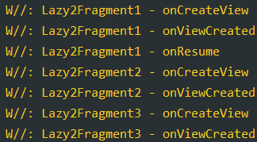

## Android开发中ViewPager+Fragment的懒加载

TabLayout+ViewPager+Fragment是我们开发常用的组合。ViewPager的默认机制就是把全部的Fragment都加载出来，而为了
保障一些用户体验，我们使用懒加载的Fragment，就是让我们再用户可见这个Fragment之后才处理业务逻辑。

而我们在一些设备或版本中可能就出现懒加载失效的问题。其实谷歌早就把一些懒加载的方案都标记弃用了，我们一直都用的老的随时会
失效的Api。万一哪天彻底失效了就会导致线上事故。

接下来我们就看看Fragment的懒加载是如何演变的。谷歌又是推荐我们如何使用的。

#### 1. Support时代的懒加载

在AndroidX还没出来的时候，大家的懒加载应该都是这样。判断setUserVisibleHint的方法，当用户可见的时候才回调方法去加载逻辑。

例如下面的封装：

```kotlin
abstract class BaseVDBLazyLoadingFragment<VM : BaseViewModel, VDB : ViewDataBinding> : AbsFragment() {

    protected lateinit var mViewModel: VM
    protected lateinit var mBinding: VDB
    private var isViewCreated = false//布局是否被创建
    private var isLoadData = false//数据是否加载
    private var isFirstVisible = true//是否第一次可见
    protected lateinit var mGLoadingHolder: Gloading.Holder

    override fun onViewCreated(view: View, savedInstanceState: Bundle?) {
        super.onViewCreated(view, savedInstanceState)
        isViewCreated = true

        init()
        startObserve()
    }

    override fun onActivityCreated(savedInstanceState: Bundle?) {
        super.onActivityCreated(savedInstanceState)

        if (isFragmentVisible(this) && this.isAdded) {

            if (parentFragment == null || isFragmentVisible(parentFragment)) {
                onLazyInitData()
                isLoadData = true
                if (isFirstVisible) isFirstVisible = false
            }
        }
    }

    //使用这个方法简化ViewModewl的Hilt依赖注入获取
    protected inline fun <reified VM : BaseViewModel> getViewModel(): VM {
        val viewModel: VM by viewModels()
        return viewModel
    }

    //反射获取ViewModel实例
    private fun createViewModel(): VM {
        return ViewModelProvider(this).get(getVMCls(this))
    }

    override fun setContentView(container: ViewGroup?): View {
        mViewModel = createViewModel()
        //观察网络数据状态
        mViewModel.getActionLiveData().observe(viewLifecycleOwner, stateObserver)

        val config = getDataBindingConfig()
        mBinding = DataBindingUtil.inflate(layoutInflater, config.getLayout(), container, false)
        mBinding.lifecycleOwner = viewLifecycleOwner

        if (config.getVmVariableId() != 0) {
            mBinding.setVariable(
                config.getVmVariableId(),
                config.getViewModel()
            )
        }

        val bindingParams = config.getBindingParams()
        bindingParams.forEach { key, value ->
            mBinding.setVariable(key, value)
        }

        return mBinding.root
    }

    abstract fun getDataBindingConfig(): DataBindingConfig

    abstract fun startObserve()
    abstract fun init()
    abstract fun onLazyInitData()

    //Loading Create Root View
    override fun transformRootView(view: View): View {
        mGLoadingHolder = generateGLoading(view)
        return mGLoadingHolder.wrapper
    }

    //如果要替换GLoading，重写次方法
    open protected fun generateGLoading(view: View): Gloading.Holder {
        return Gloading.getDefault().wrap(view).withRetry {
            onGoadingRetry()
        }
    }

    protected open fun onGoadingRetry() {
    }

    override fun onNetworkConnectionChanged(isConnected: Boolean, networkType: NetWorkUtil.NetworkType?) {
    }

    // ============================  Lazy Load begin ↓  =============================

    override fun setUserVisibleHint(isVisibleToUser: Boolean) {
        super.setUserVisibleHint(isVisibleToUser)
        if (isFragmentVisible(this) && !isLoadData && isViewCreated && this.isAdded) {
            onLazyInitData()
            isLoadData = true
        }
    }

    override fun onHiddenChanged(hidden: Boolean) {
        super.onHiddenChanged(hidden)
        //onHiddenChanged调用在Resumed之前，所以此时可能fragment被add, 但还没resumed
        if (!hidden && !this.isResumed)
            return
        //使用hide和show时，fragment的所有生命周期方法都不会调用，除了onHiddenChanged（）
        if (!hidden && isFirstVisible && this.isAdded) {
            onLazyInitData()
            isFirstVisible = false
        }
    }

    override fun onDestroy() {
        super.onDestroy()

        isViewCreated = false
        isLoadData = false
        isFirstVisible = true
    }

    /**
     * 当前Fragment是否对用户是否可见
     * @param fragment 要判断的fragment
     * @return true表示对用户可见
     */
    private fun isFragmentVisible(fragment: Fragment?): Boolean {
        return !fragment?.isHidden!! && fragment.userVisibleHint
    }
}
```

使用的示例：

```kotlin
    mBinding.viewPager.bindFragment(
            supportFragmentManager,
            listOf(LazyLoad1Fragment.obtainFragment(), LazyLoad2Fragment.obtainFragment(), LazyLoad3Fragment.obtainFragment()),
            listOf("Demo1", "Demo2", "Demo3")
        )

    mBinding.tabLayout.setupWithViewPager(mBinding.viewPager)
```

扩展方法：

```kotlin
fun ViewPager.bindFragment(
    fm: FragmentManager,
    fragments: List<Fragment>,
    pageTitles: List<String>? = null,
    behavior: Int = 0
): ViewPager {
    offscreenPageLimit = fragments.size - 1
    adapter = object : FragmentStatePagerAdapter(fm, behavior) {
        override fun getItem(p: Int) = fragments[p]
        override fun getCount() = fragments.size
        override fun getPageTitle(p: Int) = if (pageTitles == null) null else pageTitles[p]
    }
    return this
}
```

Fragment:

```kotlin
class LazyLoad1Fragment : BaseVDBLazyLoadingFragment<EmptyViewModel, FragmentDemo2Binding>() {

    companion object {
        fun obtainFragment(): LazyLoad1Fragment {
            return LazyLoad1Fragment()
        }
    }

    override fun getDataBindingConfig(): DataBindingConfig {
        return DataBindingConfig(R.layout.fragment_demo2)
    }

    override fun startObserve() {

    }

    override fun init() {

        YYLogUtils.w("LazyLoad1Fragment - init")

        mBinding.tvPage2.click {
            Demo2Pager2Activity.startInstance()
        }
    }

    //重新生成GLoading对象
    override fun generateGLoading(view: View): Gloading.Holder {
        return Gloading.from(GloadingRoatingAdapter()).wrap(view).withRetry {
            onGoadingRetry()
        }
    }

    override fun onResume() {
        super.onResume()

        YYLogUtils.w("LazyLoad1Fragment - onResume")
    }

    override fun onGoadingRetry() {
        toast("重试一个请求")
        onLazyInitData()
    }

    override fun onLazyInitData() {
        YYLogUtils.w("LazyLoad1Fragment - initData")
        //模拟的Loading的情况
        showStateLoading()

        CommUtils.getHandler().postDelayed({

            showStateSuccess()

        }, 2500)
    }
}
```

到此就实现了onLazyInitData的回调，只有当Fragment显示在前台的时候才会调用方法，执行逻辑。

#### 2. AndrodX时代的懒加载

每次判断 setUserVisibleHint 和 onHiddenChanged 也麻烦，并且他们并不稳定，我也遇到过不回调的时候。

AndroidX出来之后，给 `FragmentStatePagerAdapter` 添加了一个 `@Behavior int behavior` 的参数。

其本质就是内部帮你处理和切换MaxLifecycle：

> mCurTransaction.setMaxLifecycle(fragment, Lifecycle.State.STARTED);
>
> mCurTransaction.setMaxLifecycle(fragment, Lifecycle.State.RESUMED)；

**如何使用呢：**

```kotlin
     mBinding.viewPager.bindFragment(
            supportFragmentManager,
            listOf(LazyLoad1Fragment.obtainFragment(), LazyLoad2Fragment.obtainFragment(), LazyLoad3Fragment.obtainFragment()),
            listOf("Demo1", "Demo2", "Demo3"),
            behavior = 1
     )
```

之前的扩展方法以及预留了 `behavior` 参数，当为1的时候就不会回调 setUserVisibleHint 方法了，我们直接监听 onResume 即可。

```kotlin
kotlin复制代码class LazyLoad3Fragment : BaseVDBLoadingFragment<EmptyViewModel, FragmentDemo2Binding>() {

    var isLoaded = false

    companion object {
        fun obtainFragment(): LazyLoad3Fragment {
            return LazyLoad3Fragment()
        }
    }

    override fun getDataBindingConfig(): DataBindingConfig {
        return DataBindingConfig(R.layout.fragment_demo2)
    }

    //重新生成GLoading对象
    override fun generateGLoading(view: View): Gloading.Holder {
        return Gloading.from(GloadingLoadingAdapter()).wrap(view).withRetry {
            onGoadingRetry()
        }
    }

    override fun startObserve() {
    }

    override fun init() {
        YYLogUtils.w("LazyLoad3Fragment - init")
    }

    private fun initData() {
        YYLogUtils.w("LazyLoad3Fragment - initData")
        //模拟的Loading的情况
        showStateLoading()

        CommUtils.getHandler().postDelayed({

            showStateSuccess()

        }, 2500)

        isLoaded = true
    }

    override fun onResume() {
        super.onResume()
        YYLogUtils.w("LazyLoad3Fragment - onResume")
        if (!isLoaded) initData()
    }

    override fun onGoadingRetry() {
        toast("重试一个请求")
        initData()
    }

}
```

注意这个页面继承的就不是我们自定义的懒加载Fragment了。普通的Fragment 回调 onResume 即可。

#### 3. ViewPager2时代的懒加载

ViewPager2出来之后。我们的 `FragmentStatePagerAdapter` 退出历史舞台。如下图，它被标记过期了。


即便能用，即便效果还是和ViewPager2的效果一样，但是还是标记废弃了。具体原因我也不知道，据说是因为老版本会出现问题导致数
据丢失，页面空白。

ViewPager2我们都知道内部是通过RV实现的。但是对于Fragment的处理有单独的Adapter实现。

扩展方法：

```kotlin
/**
 * 给ViewPager2绑定Fragment
 */
fun ViewPager2.bindFragment(
    fm: FragmentManager,
    lifecycle: Lifecycle,
    fragments: List<Fragment>
): ViewPager2 {
    offscreenPageLimit = fragments.size - 1

    adapter = object : FragmentStateAdapter(fm, lifecycle) {
        override fun getItemCount(): Int = fragments.size
        override fun createFragment(position: Int): Fragment = fragments[position]
    }
    return this
}
```

使用：

```kotlin
    mBinding.viewPager2.bindFragment(
            supportFragmentManager,
            this.lifecycle,
            listOf(LazyLoad1Fragment.obtainFragment(), LazyLoad2Fragment.obtainFragment(), 
                LazyLoad3Fragment.obtainFragment())
        )

    val title = listOf("Demo1", "Demo2", "Demo3")
    TabLayoutMediator(mBinding.tabLayout, mBinding.viewPager2) { tab, position ->
        //回调
        tab.text = title[position]
    }.attach()
```

使用的方式和ViewPager差不多，这里的Fragment也是使用普通的Fragment即可。

#### 4. ViewPage和ViewPager2的性能对比

内存占用方面，ViewPager2基于RV实现的效果还是比老版ViewPager要稍好一点。

并且老版本标记废弃，所以推荐使用ViewPager2实现。如果你还是用的老版本的ViewPager也推荐使用behavor参数，使用 `onResume` 
实现懒加载的实现，这样以后使用ViewPager2时可以无缝切换过来。


# Android Fragment的懒加载，再进一步！

ViewPager+Fragment 实现懒加载的方式有多种，但是，如果我们的Fragment比较多，又或者Fragment内部的布局比较复杂，
那我们加载这样的ViewPager会不会卡顿？如果有，那可以优化吗？又有哪些优化的方案呢？

*1*

原生的使用

我们快速的实现一个ViewPager2+Fragment懒加载的效果。

布局为普通的TabLayout+ViewPager2。

```
override fun init() {
    mBinding.viewPager2.bindFragment(
        supportFragmentManager,
        this.lifecycle,
        listOf(Lazy2Fragment1(), Lazy2Fragment2(), Lazy2Fragment3())
    )

    val title = listOf("Demo1", "Demo2", "Demo3")
    TabLayoutMediator(mBinding.tabLayout, mBinding.viewPager2) { tab, position ->
        //回调
        tab.text = title[position]
    }.attach()
}
```

Fragment为普通的带Loading封装的一个Fragment。

```
class Lazy2Fragment1 : BaseVMLoadingFragment() {
    var isInitDataLoaded = false

    companion object {
        fun obtainFragment(): Lazy2Fragment1 {
            return Lazy2Fragment1()
        }
    }

    //重新生成GLoading对象
    override fun generateGLoading(view: View): Gloading.Holder {
        return Gloading.from(GloadingRoatingAdapter()).wrap(view)
    }

    override fun getLayoutIdRes(): Int = R.layout.lazy2_fragment1

    override fun init() {
    }

    override fun onCreateView(inflater: LayoutInflater, container: ViewGroup?, savedInstanceState: Bundle?): View? {
        YYLogUtils.w("Lazy2Fragment1 - onCreateView")
        return super.onCreateView(inflater, container, savedInstanceState)
    }

    override fun onViewCreated(view: View, savedInstanceState: Bundle?) {
        YYLogUtils.w("Lazy2Fragment1 - onViewCreated")
        super.onViewCreated(view, savedInstanceState)
    }

    override fun onResume() {
        super.onResume()
        YYLogUtils.w("Lazy2Fragment1 - onResume")

        if (!isInitDataLoaded) {
            onLazyInitData()
        }
    }

    private fun onLazyInitData() {
        YYLogUtils.w("Lazy2Fragment1 - initData")
        //模拟的Loading的情况
        showStateLoading()

        CommUtils.getHandler().postDelayed({
            showStateSuccess()
            isInitDataLoaded = true
        }, 1000)
    }
}
```

懒加载就已经默认实现了，在 OnResume 的时候触发网络请求即可，每次滑动ViewPager会自动触发 OnResume 方法。

生命周期如下：



然后滚动到Fragment2 Fragment3 再滚动回来，生命周期如下：


很简单的就能实现懒加载的效果，那这样懒加载就能优化性能了吗？

确实优化了，特别是RV列表，没有网络数据就不会填充列表。我觉得更重要的是帮用户节约了流量吧。毕竟没有显示出来的页面不会请求网络。

那么如果Fragment就是一些静态的页面，懒加载还能优化性能吗？

*2*

懒加载的痛点与优化方案

可以看到我们所谓的 Fragment 懒加载，也只是逻辑的懒加载，处理的是 initData 加载数据的懒加载，如果 Fragment 内部的
布局是列表RV这样的，问题不大，但是如果是复杂的长滚动布局，又或者是不同的复杂布局，那么就会卡顿。

因为 ViewPager+Fragment 的懒加载,是会加载子 Fragment 的布局的，内部每一个 Fragment 都会走 onCreateView 和
onViewCreated 来加载布局。如果你的布局比较复杂当然很耗时了。

有什么方案解决和优化这样的情况？大家普遍的方法都是 Loading 的时候不加载真正的布局，等加载数据完成之后再填充真正的布局。

于是就有了这样的写法：

```
<?xml version="1.0" encoding="utf-8"?>
<FrameLayout xmlns:android="http://schemas.android.com/apk/res/android"
    android:layout_width="match_parent"
    android:layout_height="match_parent"
    android:background="@color/white"
    android:orientation="vertical">

    <ViewStub
        android:id="@+id/view_stub_1"
        android:layout_width="match_parent"
        android:layout_height="match_parent"
        android:layout="@layout/view_stub_fragment1" />

</FrameLayout>

private lateinit var mViewStub: ViewStub

override fun initViews(view: View) {
    mViewStub = view.findViewById(R.id.view_stub_1)
}

private fun onLazyInitData() {
    YYLogUtils.w("Lazy2Fragment1 - initData")
    //模拟的Loading的情况
    showStateLoading()

    CommUtils.getHandler().postDelayed({
        showStateSuccess()
        mViewStub.inflate()  //加载网络数据成功之后展示布局
        isInitDataLoaded = true
    }, 1000)
}

```

这样才能做到真正的懒加载，布局懒加载，业务逻辑懒加载。

这也是大家普遍的优化做法，好处是可以加快 Activity 的加载速度。如果Fragment 内布局复杂，那么更能体现此做法的好处，
越是复杂的布局优化效果越大。

但是这样也只是优化了Activity的启动速度，当数据加载出来之后 inflate 布局，算是懒加载了，但是如果布局实在是复杂，
依然会卡顿，之前的项目就是复杂布局加载耗时800毫秒，就会明显感知到一顿。掉帧的情况。

那我们之前的文章也有讲到，AsyncViewStub 的自定义，我们可以通过此方法与加载数据的方法并发执行来优化 Fragment 懒加载。

*3*

修改自定义加载布局

AsyncViewStub 的自定义，具体请看——[异步加载布局](../异步加载布局.md)。

最简单的方式，直接替换ViewStub：

```
<?xml version="1.0" encoding="utf-8"?>
<FrameLayout xmlns:android="http://schemas.android.com/apk/res/android"
    android:layout_width="match_parent"
    android:layout_height="match_parent"
    android:background="@color/white"
    android:orientation="vertical">

    <com.xxx.lib_baselib.view.AsyncViewStub
        android:id="@+id/view_stub_1"
        android:layout_width="match_parent"
        android:layout_height="match_parent"
        android:layout="@layout/view_stub_fragment1" />

</FrameLayout>

private lateinit var mViewStub: ViewStub

override fun initViews(view: View) {
    mViewStub = view.findViewById(R.id.view_stub_1)
}

private fun onLazyInitData() {
    YYLogUtils.w("Lazy2Fragment1 - initData")
    //模拟的Loading的情况
    showStateLoading()

    CommUtils.getHandler().postDelayed({
        showStateSuccess()
        mViewStub.inflateAsync()  //加载网络数据成功之后展示布局
        isInitDataLoaded = true
    }, 1000)
}
```

只是替换为异步加载的ViewStub。这样当数据加载成功之后我们使用的是异步加载布局然后填充布局，这样如果是复杂的布局不会卡顿但是会等待。

是优化了，但是又没完全优化。

我们能不能让异步加载布局和网络请求并发？然后两者任务都完成了再展示布局填充数据？

试试！

```
private fun onLazyInitData() {
    lifecycleScope.launch {
        //模拟的Loading的情况
        showStateLoading()

        val isInflate = async {
            if (!mViewStub.isInflate()) {
                mViewStub.inflateAsync()
            }
            true
        }

        val data = async(Dispatchers.IO) {
            delay(1000)
            isInitDataLoaded = true
            "return data"
        }

        if (!TextUtils.isEmpty(data.await()) && isInflate.await()) {
            showStateSuccess()
            //popupData2View
        }
    }
}
```

这样就能并发实现异步加载布局，异步请求数据，然后展示到控件并展示。

如果大家不是使用的协程，一样的可以通过成员变量来控制，达到同样的效果。

*4*

总结

深度懒加载的实现：Fragment的懒加载 + 布局的异步懒加载。

通过两者结合的方法就能真正的实现 Fragment 的完全懒加载，布局和逻辑的懒加载达到性能的最优化。