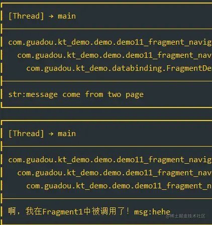
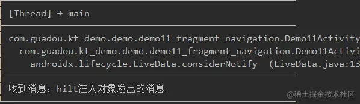

Activity与Fragment的通信属实是老生常谈的话题了，还能整出什么花活。其实网上的都是比较老的方法了，在2022年的今天，我们看看到目前为止有哪些通信方式。在单Activity与多Fragment的框架下，又有哪些通信方式呢？

#### 一、接口通信

这应该是最常见的方式了，属于网上最多的推荐方式了，简单的过一下。

定义2个接口，给Activity实现，方便Fragment调用

```kotlin
kotlin复制代码interface IOneFragmentCallback {

    fun callActOne(str: String)

}

interface ITwoFragmentCallback {

    fun callActTwo(str: String)
}
```

定义Activity实现2个接口

```kotlin
kotlin复制代码class Demo11Activity : BaseVMActivity(), IOneFragmentCallback, ITwoFragmentCallback {

    ...

    override fun callActOne(str: String) {
        YYLogUtils.w("str:$str")

    }

    override fun callActTwo(str: String) {
        YYLogUtils.w("str:$str")

    }

}
```

在Fragment中拿到对应的接口实例对象，直接调用 伪代码如下：

```kotlin
kotlin复制代码class Demo11Fragment1(private val test: String) : BaseFragment(){
   
   ...

    private lateinit var mCallback: IOneFragmentCallback
    override fun onAttach(context: Context) {
        super.onAttach(context)
        mCallback = context as IOneFragmentCallback
    }

    @Click
    fun callback() {
       mCallback.callActOne("message come from one page")
    }
}
kotlin复制代码class Demo11Fragment2(private val test: String) : BaseFragment(){
   
   ...

    private lateinit var mCallback: ITwoFragmentCallback
    override fun onAttach(context: Context) {
        super.onAttach(context)
        mCallback = context as ITwoFragmentCallback
    }

    @Click
    fun callback() {
       mCallback.callActTwo("message come from two page")
    }
}
```

我们通过Fragment通知到了Activity：

> -> str: message come from one page
>
> -> str: message come from two page


没错，那么Activity怎么通知Fragment呢？那还不简单，Activity本身就拿到了Fragment的实例，直接调用函数就行了，如果是接口直接强转为接口对象调用即可！

什么？你用的Navigation？Fragment都是xml自动管理的，Activity中没有Fragment的实例？这如何调用？


其实有办法的，看看我们Activity中的xml是 `FragmentContainerView`  就算直接通过 `supportFragmentManager` 拿到Fragment也是不对的。拿到的是一个Fragment容器，我们的真正fragment是由这个容器 `NavHostFragment` 管理的。

```xml
xml复制代码   <androidx.fragment.app.FragmentContainerView
        android:id="@+id/nav_host"
        android:name="androidx.navigation.fragment.NavHostFragment"
        android:layout_width="match_parent"
        android:layout_height="match_parent"
        android:background="@color/white"
        app:defaultNavHost="true" />
```

我们先通过`supportFragmentManager` 拿到 `NavHostFragment` 容器，然后通过此容器`NavHostFragment` 的 `childFragmentManager` 拿到真正的容器，扩展方法如下：

```kotlin
kotlin复制代码//获取全部的Fragment
fun NavHostFragment.getAllFragments(): List<Fragment> {
    val list = arrayListOf<Fragment>()
    navController.mBackStack.forEachIndexed { index, entry ->
        entry.destination.let { des ->
            if (des is FragmentNavigator.Destination) {
                val frag = childFragmentManager.fragments[index - 1]
                list.add((frag as NavContainerFragment).mRealFragment)
            }
        }
    }
    return list
}

//根据Activity获取到Fragments
fun FragmentActivity.getAllNavFragments(navHostRes: Int): List<Fragment> {
    val navHostFragment = supportFragmentManager.findFragmentById(navHostRes) as NavHostFragment
    return navHostFragment.getAllFragments()
}
```

我们添加2个Activity调用Fragment的接口，并在Fragment实现它们：

```kotlin
kotlin复制代码interface IOneActivityCallback {

    fun callOneFragment(string: String)

}

interface ITwoActivityCallback {

    fun callTwoFragment(string: String)

}
```

Fragment实现接口，给Activity调用：

```kotlin
kotlin复制代码class Demo11Fragment1(private val test: String) : BaseFragment(){
   
   ...

    private lateinit var mCallback: IOneFragmentCallback
    override fun onAttach(context: Context) {
        super.onAttach(context)
        mCallback = context as IOneFragmentCallback
    }

    @Click
    fun callback() {
       mCallback.callActOne("message come from one page")
    }

    override fun callOneFragment(string: String) {
       YYLogUtils.w("啊，我在Fragment1中被调用了！msg:$string")
    }
}
kotlin复制代码class Demo11Fragment2(private val test: String) : BaseFragment(){
   
   ...

    private lateinit var mCallback: ITwoFragmentCallback
    override fun onAttach(context: Context) {
        super.onAttach(context)
        mCallback = context as ITwoFragmentCallback
    }

    @Click
    fun callback() {
       mCallback.callActTwo("message come from two page")
    }

    override fun callTwoFragment(string: String) {
       YYLogUtils.w("啊，我在Fragment2中被调用了！msg:$string")
    }
}
```

我们实现的功能为：fragment2点击callback，回调给Activity，Activity再拿到fragment1的实例回调给fragment1的方法。

修改Activity的回调函数如下：

```kotlin
kotlin复制代码class Demo11Activity : BaseVMActivity(), IOneFragmentCallback, ITwoFragmentCallback {

    ...

    override fun callActOne(str: String) {
        YYLogUtils.w("str:$str")

        getAllNavFragments(R.id.nav_host).firstOrNull {
            it is ITwoActivityCallback
        }?.let {
            (it as ITwoActivityCallback).callTwoFragment("yeye")
        }
    }

    override fun callActTwo(str: String) {
        YYLogUtils.w("str:$str")

        getAllNavFragments(R.id.nav_host).firstOrNull {
            it is IOneActivityCallback
        }?.let {
            (it as IOneActivityCallback).callOneFragment("hehe")
        }
    }

}
```

这样就可以实现Navigation下单Activity+多Fragment的以接口的方式回调了。

效果：


#### 二、Function的缓存方式

就是把需要调用的方法使用Function的方式缓存起来，在使用的时候取出来执行不就Ok了吗？都不限制于Fragment与Activity，简直是黑科技，有没有一点EventBus的味道了。

已有实现 [ActivityCommWithFragment。](https://link.juejin.cn?target=https%3A%2F%2Fgithub.com%2Fniuxiaowei%2FActivityCommWithFragment)和 鸿洋的[FABridge](https://link.juejin.cn?target=https%3A%2F%2Fgithub.com%2FhongyangAndroid%2FFABridge)。都是基于此思路实现。

下面是简单的实现：

把方法对象集合放入Map中 在内存中存储

```java
java复制代码public abstract class Function {
    public String functionName;//名称
    public Function(String functionName) {
        this.functionName=functionName;
    }
}
```

定义四种类型的方法，是否带参数和带返回值

```java
java复制代码public abstract class FunctionNoParamNoResult extends Function {
 
    public FunctionNoParamNoResult(String functionName) {
        super(functionName);
    }
 
    protected abstract void function();
}
java复制代码public abstract class FunctionNoParamWithResult<Result> extends Function {
 
    public FunctionNoParamWithResult(String functionName) {
        super(functionName);
    }
 
    protected  abstract Result function();
}
java复制代码public abstract class FunctionWithParamNoResult<Param> extends Function {
 
    public FunctionWithParamNoResult(String functionName) {
        super(functionName);
    }
 
    protected abstract void function(Param param);
}
java复制代码public abstract class FunctionWithParamWithResult<Result,Param> extends Function {
    public FunctionWithParamWithResult(String functionName) {
        super(functionName);
    }
 
    protected abstract Result function(Param param);
}
```

我们通过一个管理类来添加方法执行方法：

```java
java复制代码public class FunctionManager {
 
    private static FunctionManager functionManager;
 
    public FunctionManager() {
        mFunctionNoParamNoResult=new HashMap<>();
        mFunctionWithParamWithResult=new HashMap<>();
        mFunctionWithParamNoResult=new HashMap<>();
        mFunctionNoParamWithResult=new HashMap<>();
    }
 
    public static FunctionManager getInstance(){
        if(functionManager==null){
            functionManager=new FunctionManager();
        }
        return functionManager;
    }
 
 
    private static HashMap<String,FunctionNoParamNoResult> mFunctionNoParamNoResult;
    private static HashMap<String,FunctionWithParamWithResult> mFunctionWithParamWithResult;
    private static HashMap<String,FunctionWithParamNoResult> mFunctionWithParamNoResult;
    private static HashMap<String,FunctionNoParamWithResult> mFunctionNoParamWithResult;
 
    /**
     * 添加无参数无返回值
     * @param function
     * @return
     */
    public FunctionManager addFunction(FunctionNoParamNoResult function){
        if(mFunctionNoParamNoResult!=null){
            mFunctionNoParamNoResult.put(function.functionName,function);
        }
        return this;
    }
 
    /**
     * 添加有参数有返回值
     * @param function
     * @return
     */
    public FunctionManager addFunction(FunctionWithParamWithResult function){
        if(mFunctionWithParamWithResult!=null){
            mFunctionWithParamWithResult.put(function.functionName,function);
        }
        return this;
    }
 
    /**
     * 添加有参数无返回值
     * @param function
     * @return
     */
    public FunctionManager addFunction(FunctionWithParamNoResult function){
        if(mFunctionWithParamNoResult!=null){
            mFunctionWithParamNoResult.put(function.functionName,function);
        }
        return this;
    }
 
    /**
     * 添加吴参数有返回值
     * @param function
     * @return
     */
    public FunctionManager addFunction(FunctionNoParamWithResult function){
        if(mFunctionNoParamWithResult!=null){
            mFunctionNoParamWithResult.put(function.functionName,function);
        }
        return this;
    }
 
    /**
     * 执行没参数没返回值的
     * @param key
     */
    public void invokeFunction(String key){
        if(TextUtils.isEmpty(key)){
            return;
        }
        if(mFunctionNoParamNoResult!=null){
            FunctionNoParamNoResult functionNoParamNoResult=mFunctionNoParamNoResult.get(key);
            if(functionNoParamNoResult!=null){
                functionNoParamNoResult.function();
            }else {
                try {
                    throw new FunctionException("function not found");
                } catch (FunctionException e) {
                    e.printStackTrace();
                }
            }
        }
    }
 
    /**
     * 有参数有返回值
     * @param key
     * @param param
     * @param result
     * @param <Result>
     * @param <Param>
     * @return
     */
    public <Result,Param>Result invokeFunction(String key,Param param,Class<Result> result){
        if(TextUtils.isEmpty(key)){
            return null;
        }
        if(mFunctionWithParamWithResult!=null){
            FunctionWithParamWithResult f=mFunctionWithParamWithResult.get(key);
            if(f!=null){
                if(result==null){
                    return (Result) f.function(param);
                }else {
                    return result.cast(f.function(param));
                }
 
            }else {
                try {
                    throw new FunctionException("function not found");
                } catch (FunctionException e) {
                    e.printStackTrace();
                }
            }
        }
        return null;
    }
 
}
```

使用的时候也是很简单，例如在Fragment初始化的的是我们通过管理类添加需要调用的方法。然后再Activity就可以通过管理类直接调用这个方法。如果没有remove那么这个方法的map会越来越大，所以我们需要在Fragment Destory的时候移除掉。

其实这一种思路不止可以用于通信，还能用与其他地方，这里我没有详细的展开，是因为虽说是黑科技，但是我们还有更便捷的方式，所以这种方案是用的比较少的。

#### 三、消息的方式

终于到大家喜欢的发消息的方式了，使用接口需要定义的类太多，太麻烦。使用方法缓存的方式，还需要额外的内存开销。搞不好还内存泄露，更便捷的方式肯定是消息总线的方式了。

实现的方式可以分很多种EventBus ，广播，LiveDataBus等。只要是消息总线的方式都可以实现功能。具体的分析与实现可以看我的[这一篇](https://juejin.cn/post/7108604765898014757)。

这里我们以最简单的FlowBus来演示：

```kotlin
kotlin复制代码object FlowBus {
    private val busMap = mutableMapOf<String, EventBus<*>>()
    private val busStickMap = mutableMapOf<String, StickEventBus<*>>()

    @Synchronized
    fun <T> with(key: String): EventBus<T> {
        var eventBus = busMap[key]
        if (eventBus == null) {
            eventBus = EventBus<T>(key)
            busMap[key] = eventBus
        }
        return eventBus as EventBus<T>
    }

    @Synchronized
    fun <T> withStick(key: String): StickEventBus<T> {
        var eventBus = busStickMap[key]
        if (eventBus == null) {
            eventBus = StickEventBus<T>(key)
            busStickMap[key] = eventBus
        }
        return eventBus as StickEventBus<T>
    }

    //真正实现类
    open class EventBus<T>(private val key: String) : LifecycleObserver {

        //私有对象用于发送消息
        private val _events: MutableSharedFlow<T> by lazy {
            obtainEvent()
        }

        //暴露的公有对象用于接收消息
        val events = _events.asSharedFlow()

        open fun obtainEvent(): MutableSharedFlow<T> = MutableSharedFlow(0, 1, BufferOverflow.DROP_OLDEST)

        //主线程接收数据
        fun register(lifecycleOwner: LifecycleOwner, action: (t: T) -> Unit) {
            lifecycleOwner.lifecycle.addObserver(this)
            lifecycleOwner.lifecycleScope.launch {
                events.collect {
                    try {
                        action(it)
                    } catch (e: Exception) {
                        e.printStackTrace()
                        YYLogUtils.e("FlowBus - Error:$e")
                    }
                }
            }
        }

        //协程中发送数据
        suspend fun post(event: T) {
            _events.emit(event)
        }

        //主线程发送数据
        fun post(scope: CoroutineScope, event: T) {
            scope.launch {
                _events.emit(event)
            }
        }

        //自动销毁
        @OnLifecycleEvent(Lifecycle.Event.ON_DESTROY)
        fun onDestroy() {
            YYLogUtils.w("FlowBus - 自动onDestroy")
            val subscriptCount = _events.subscriptionCount.value
            if (subscriptCount <= 0)
                busMap.remove(key)
        }
    }

    class StickEventBus<T>(key: String) : EventBus<T>(key) {
        override fun obtainEvent(): MutableSharedFlow<T> = MutableSharedFlow(1, 1, BufferOverflow.DROP_OLDEST)
    }

}
```

我们使用FlowBus发送消息：

```kotlin
kotlin复制代码class Demo11Fragment2(private val test: String) : BaseFragment(){
   
   ...

    @Click
    fun callback() {
        FlowBus.with<String>("test-key-01").post(lifecycleScope, "Test Flow Bus Message")
    }

}
```

Fragment1来接收消息：

```kotlin
kotlin复制代码class Demo11Fragment1(private val test: String) : BaseFragment(){
   
   ...

    override fun startObserve() {

        FlowBus.with<String>("test-key-01").register(this) {
            YYLogUtils.w("收到FlowBus消息 - $it")
        }
    }

}
```

结果：

> -> 收到FlowBus消息  - Test Flow Bus Message


可以说是非常简单，相信大家日常开发中使用最多的应该就是此种方法了！

讲到这里有了结果，就要完结了吗? 到2022年的今天还有没有其他的方式。我们继续探讨一下。

#### 四、ViewModel管理

ViewModel 我们都熟悉了，我们在 Activity+Fragment 的框架中，我们可以通过 Fragment 的扩展方法 `activityViewModels() ` 来获取到父Activity的 ViewModel 对象，由此我们就能拿到 ViewModel 中定义的 LiveData 或者 Flow 对象。间接的实现 Activity 与 Fragment 的通信或 Fragment 与 Fragment 的通信。

我们分别定义读写分类的LiveData与StateFlow

```kotlin
kotlin复制代码class Demo11ViewModel : BaseViewModel() {

    private val _backOneLiveData = MutableLiveData<String>()
    val mBackOneLD: LiveData<String> get() = _backOneLiveData

    private val _msgFlow = MutableStateFlow("")
    val mMsgFlow: StateFlow<String> = _msgFlow.asStateFlow()

    fun setCallbackValue() {
        _backOneLiveData.value = "test value"
        _msgFlow.value = "test flow value"
    }
```

我们使用Fragment2发送消息：

```kotlin
kotlin复制代码class Demo11Fragment2(private val test: String) : BaseFragment(){

    private val activityViewModel: Demo11ViewModel by activityViewModels()
   ...

    @Click
    fun callback() {
       activityViewModel.setCallbackValue()
    }

}
```

Fragment1来接收消息：

```kotlin
kotlin复制代码class Demo11Fragment1(private val test: String) : BaseFragment(){
   
    private val activityViewModel: Demo11ViewModel by activityViewModels()
   ...

    override fun startObserve() {

        activityViewModel.mBackOneLD.observe(this) {
            YYLogUtils.w("收到LD消息 - $it")
        }

        lifecycleScope.launch {
            activityViewModel.mMsgFlow.collect {
                YYLogUtils.w("收到Flow消息 - $it")
            }
        }
    }

}
```

打印日志如下：

> -> 收到LD消息 -  test value
>
> -> 收到Flow消息 - test flow value


既然ViewMoel都可以，那么依赖注入容器是不是也可以?

#### 五、Hilt依赖注入管理

Hilt是Android场景化的一个依赖注入容器，都是一些固定的用法，如果不是很明白可以看我之前的[文章](https://juejin.cn/post/7102956956653977637)。

Hilt其实和ViewModel一样的逻辑，我们只需要保证LiveData或Flow是一个对象不就行了吗？

我们尝试一下，看看到底行不行？先定义一个DI容器

```kotlin
kotlin复制代码@Module
@InstallIn(SingletonComponent::class)
class Demo11Module {

    @Provides
    fun provideMsg(): String {
        return "di提供的消息"
    }

    @Singleton
    @Provides
    fun provideLD(): MutableLiveData<String> {
        return MutableLiveData()
    }

}
```

然后在Activity与Fragment中注入这个对象

```kotlin
kotlin复制代码@AndroidEntryPoint
class Demo11Activity : BaseVMActivity(), IOneFragmentCallback, ITwoFragmentCallback {

    @Inject
    lateinit var mMsgLD: MutableLiveData<String>
    ...

    override fun startObserve() {

        mMsgLD.observe(this) {
            YYLogUtils.w("收到消息：" + it)
        }
    }

}
kotlin复制代码@AndroidEntryPoint
class Demo11Fragment2(private val test: String) : BaseFragment(){

    @Inject
    lateinit var mMsgLD: MutableLiveData<String>
   ...

    @Click
    fun callback() {
        mMsgLD.value = "hilt注入对象发出的消息"
    }

}
```

调用的方法和ViewModel类似的，一边设置值，另一边接收值，可以看出同样的效果：


#### 总结

其实依赖注入的运行方式和ViewModel类似的，只是不局限于一个Activity下面了，因为ViewModel是ActivityScope内的。这样我们通过依赖注入可以实现在OneACtivity下面的OneFragment直接通知到TwoACtivity下面的TwoFragment。

当然跨页面之间的通信我们可以用消息总线FlowBus来实现，更加方便。在实际开发中我们一般也是用消息总线+ViewModel管理这两种方法。

Ok,到这里就差不多了，还有其他非主流的Handle Bundle等其他不常用的方式就不一一介绍了。