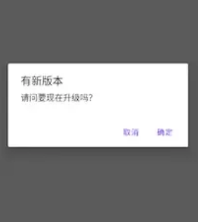

# 1、背景

在许多公司，APP版本都是不受重视的，产品忙着借鉴，开发埋头编码，测试想着不粘锅。

只有在用户反馈app不能用的时候，你回复客服说，让用户升级最新版本，是不是很真实。

而且业界也很少有听说版本治理的，但其实需求上线并不是终点，在用户数据回传之前，这中间还有一个更新升级的空档期，多数公司在这里都是一个“三不管”地带，而这个空档期，我称之为**版本交付的最后一公里**。

# 2、价值

## 2.1、业务侧

总有人会挑战“有什么业务价值？”对吧，那就先从业务价值来看。

尽管有些app的有些业务是动态发布的，但也一定会有些功能是依赖跟版的，也就是说，你没办法让所有用户都用上你的新功能，那对于产运团队来说，业务指标就还有提升的空间。

举两个例子：

1. 饿了么免单活动需要8.+版本以上的app用户才能参与，现在参与用户占比80%，治理一波后，免单用户参与占比提升到90%，对业务来说，免单数没变，但是订单量却是有实实在在的提升的。
2. 再来一个，酷狗音乐8.+的app用户才可以使用扫码登录，app低版本治理之后，扫码登录的用户占比势必也会提升，那相应的，登录成功率也可以提升，登录流程耗时也会缩短，这都是实实在在的指标提升。

> 虚拟数据，不具备真实参考性。

## 2.2、技术侧

说完业务看技术，在技术侧也可以分为三个维度来看：

1. 稳定性，老版本的crash、anr之类的问题在新版本大概率是修复了的，疑难杂症可能久一点；
2. 性能优化，比如启动、包大小、内存，可以预见是比老版本表现更好的，个别指标一两个版本可能会有微量劣化，但是一直开倒车的公司早晚会倒闭；
3. 安全合规，不管是老的app版本还是老的服务接口，都可能会存在安全问题，那么黑产就可能抓住这个漏洞从而对我们服务的稳定性造成隐患，甚至产生资损；

## 2.3、其他方面

除了上面提到的业务指标和用户体验之外，还有没有？

有没有想过，老版本的用户升上来之后，那些兼容老版本的接口、系统服务等，是不是可以下线了，除了减少人力维护成本之外，还能减少机器成本啊，这也都是实打实的经费支出。

对于项目本身来说，也可以去掉一些无用代码，减少项目复杂度，提升健壮性、可维护性。

# 3、方案

## 3.1、升级交互

采用新的设计语言和新的交互方式。

### 3.1.1、弹窗样式

样式上要符合app整体的风格，信息展示明确，主次分明。

| **bad case**                                                 | **good case**                                                |
| ------------------------------------------------------------ | ------------------------------------------------------------ |
|  |  |

### 3.1.2、操作表达

按钮的样式要凸显出来，并放在常规易操作的位置上。

| **bad case**                                                 | **good case**                                                |
| ------------------------------------------------------------ | ------------------------------------------------------------ |
|  |  |

### 3.1.3、提醒链路

从一级菜单到二级页面的更新提醒链路，并保持统一。

### 3.1.4、进度感知

下载进度一定要可查看并准确，如果点了按钮之后什么提示都没有，用户会进入一个很迷茫的状态，体验很差。

## 3.2、提醒策略

我们需要针对不同的用户下发不同的提醒策略，这种更细致的划分，不光是为了稳定性和目标的达成，也是为了更好的用户体验，毕竟反复提醒容易引起用户的反感。

### 3.2.1、提醒时机

提醒时机其实是有讲究的，**原则上是不能阻塞用户的行为。**

特别是有强制行为的情况，比如强更，肯定不能在app启动就无脑拉起弹窗。

> bad case：双十一那天，用户正争分夺秒准备下单呢，结果你让人升级，这不扯淡的吗。

时机的考虑上有两个维度：

1. 平台：峰时谷时；
2. 用户：闲时忙时；

### 3.2.2、逻辑引擎

为什么需要逻辑引擎呢？逻辑引擎的好处是跨端，双端逻辑可以保持一致，也可以动态下发。

> 可以使用接口平替，约定好协议即可。

### 3.2.3、软强更

强制更新虽然有可以预见的好效果，但是也伴随着投诉风险，要做好风险管控。

而在2023-02-27日，工信部更是发布了《关于进一步提升移动互联网应用服务能力》的通知，其中第四条更是明确表示“窗口关闭用户可选”，
所以强更弹窗并不是我们的最佳选择。

虽然强更不可取，但是我们还可以提高用户操作的费力度，在取消按钮上增加倒计时，再根据低版本用户的分层，来配置不同的倒计时梯度，
比如5s、10s、20s这样。

用户一样可以选择取消，但是却要等待一会，所以称之为`软强更`。

### 3.2.4、策略字段

- 标题
- 内容
- 最新版本号
- 取消倒计时时长
- 是否提醒
- 是否强更
- 双端最低支持的系统版本
- 最大提醒次数
- 未更新最大版本间隔
- 等等

## 3.3、提示文案

升级文案属于是ROI很高的了，只需要总结一下新版本带来了哪些新功能、有哪些提升，然后配置一下就好了，但是对用户来说，却是
实打实的信息冲击，他们可以明确的感知到新版本中的更新，对升级意愿会有非常大的提升。

> 虽然说roi很高，但是也要花点心思，特别是大的团队，需要多方配合。
>
> 首先是需求要有精简的价值点，然后运营同学整合所有的需求价值点，根据优先级，出一套面向用户的提醒话术，也就是提示的升级文案了。

## 3.4、更新渠道

iOS用户一般在App Store更新应用，但是对于Android来说，厂商比较多，对应的渠道也多，还有一些三方的，这些碎片化的渠道自然就
把用户人群给分流了，为了让每一个用户都有渠道可以更新到最新版本，那就需要在渠道的运营上下点功夫了，尽可能的多覆盖。

除了拓宽更新渠道之外，在应用市场的介绍也要及时更新。

还有一点细节是，优化应用市场的搜索关键词。

最后，别忘了自有渠道-官网。

## 3.5、触达投放

如果我们做了上面这么多，还是有老版本的用户不愿意升级怎么办？我们还有哪些方式可以告诉他需要升级？

触达投放是一个很好的方式，就像游戏里的公告、全局喇叭一样，但是像发短信这种需要预算的方式一般都是放在最后使用的，尽可能的控制成本。

> 避免过度打扰，做好人群细分，控制好成本。

## 3.6、其他方案

| **类型**     | **介绍**                                                     | **效果** |
| ------------ | ------------------------------------------------------------ | -------- |
| **更新引导** | 更新升级操作的新手引导                                       | 😀        |
| **操作手册** | 描述整个升级流程，可以放在帮助页面，也可以放在联系客服的智能推荐 | 🙂        |
| **营销策略** | 升级给会员体验、优惠券之类的                                 | 😀        |
| **内卷策略** | 您获得了珍贵的内测机会，您使用的版本将领先同行98%            | 😆        |
| **选择策略** | 「88%的用户选择升级」，替用户做选择                          | 😆        |
| **心理策略** | 「预计下载需要15秒」，给用户心理预期                         | 😀        |
| **接口拦截** | 在使用某个功能或者登录的时候拦截，引导下载最新版本           | 😆        |
| **自动下载** | 设置里面加个开关，wifi环境下自动下载安装包                   | 😀        |
| **版本故事** | 类似于微信，每个版本都有一个功能介绍的东西，点击跳转加上新手引导 | 🙂        |

好的例子：

| **淘宝**                                                     | **拼多多**                                                   |
| ------------------------------------------------------------ | ------------------------------------------------------------ |
|  |  |

# 4、长效治理

制定流程SOP，形成一个完整链路的组合拳打法🐶。

白话讲，就是每当一个新版本发布的时候，明确在每个时间段要做什么事，达成什么样的目标。

让更多需要人工干预的环节，都变成流程化，自动化。

# 5、最后

一张图总结APP版本治理依次递进的动作和策略。
